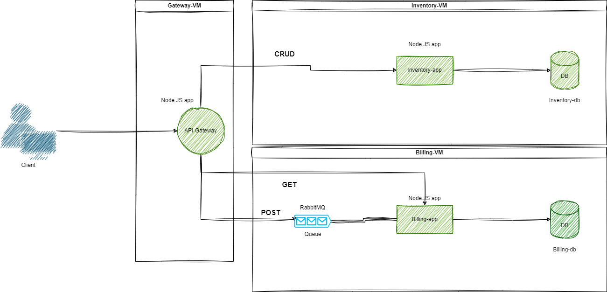

# GETTING STARTED WITH MICROSERVICES

## General overview

[Project description](./resources/project-overview.md) contains the requirements and the general overview of the project.

## How to start?

If you want to create this project from scratch you can check out the [project overview](./resources/project-overview.md) to get started. If you want to setup the project using this repository you can check out the [how to setup](./resources/how.md) file. I created this readme for my own use, but I hope it can be useful for others too. I started this project to have more experience on creating microservices and to have a project that I can use as a base for future projects.
